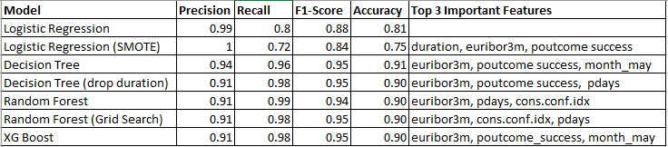
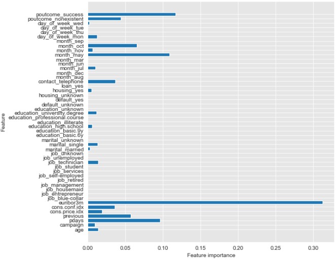
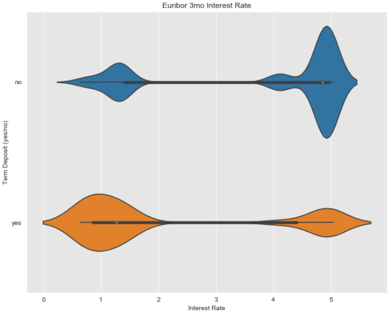
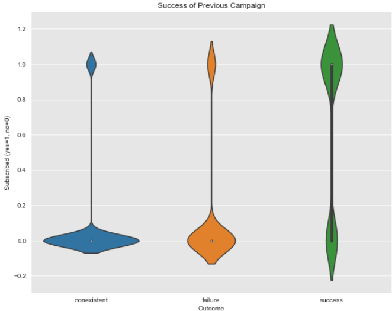
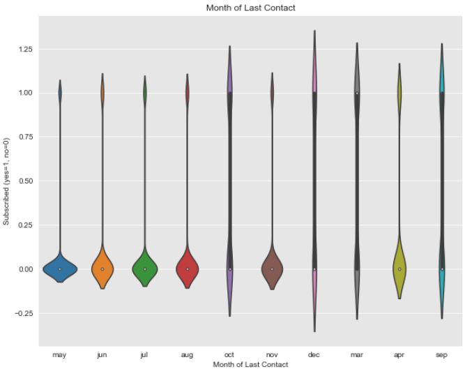

# Bank Marketing Data ReadMe

# Dataset

This project uses the Bank Marketing Dataset from UCI's archives (https://archive.ics.uci.edu/ml/datasets/bank+marketing) to find the best machine learning strategies to improve for the next marketing campaign. The goal is to provide an accurate predictive model for whether or not a potential client will or will not subscribe to a term deposit.

- Output Variable (desired target):
    - y - has the client subscribed a term deposit? (binary: "yes","no")
    
    
 - Input Variables - 
   - Continuous:
   
    - age (numeric)
    - duration: last contact duration, in seconds (numeric)
        - Important note:  this attribute highly affects the output target (e.g., if duration=0 then y="no"). Yet, the duration is not known before a call is performed. Also, after the end of the call y is obviously known. Thus, this input should only be included for benchmark purposes and should be discarded if the intention is to have a realistic predictive model.
    - campaign: number of contacts performed during this campaign and for this client
    - pdays: number of days that passed by after the client was last contacted from a previous campaign
    - previous: number of contacts performed before this campaign and for this client
    - emp.var.rate: employment variation rate - quarterly indicator
    - cons.price.idx: consumer price index - monthly indicator     
    - cons.conf.idx: consumer confidence index - monthly indicator    
    - euribor3m: euribor 3 month rate - daily indicator
    - nr.employed: number of employees - quarterly indicator
<br>  
  
  - Categorical:
    - job : type of job
    - marital : marital status
    - education
    - default: has credit in default
    - housing: has housing loan
    - loan: has personal loan
    - contact: contact communication type 
    - month: last contact month of year 
    - day_of_week: last contact day of the week 
    - poutcome: outcome of the previous marketing campaign 

<br>
- The dataframe has 41188 rows and 21 columns with no missing values. The last column, 'y', is the target variable. The other 20 columns are divided evenly between continuous and categorical independent variables.

# Scrub

Three subsets of data were created for the subsequent cleaning process:
- Continuous dataframe (cont_df)
    - Visualize df and check for outliers
    - Address skewness of variables (campaign, duration, previous, and pday) by removing top 5% outliers
    - Replace 999 values with 0's for pdays
- Categorical dataframe (cat_df)
    - Create dummy variables for categorical data
- Target dataframe (target)
    - Replace target no/yes values with binary 0/1 values

# Explore

Both continuous and categorical subsets were visualized in separate correlation matricies to address any multicollinearity issues prior to modeling.


- Continuous data with correlative variables above 0.8:
    - nr.employed, number of employees - quarterly indicator
    - emp.var.rate, euribor 3 month rate - daily indicator
    - euribor3m, employment variation rate - quarterly indicator
        - Dropped nr.employed and emp.var.rate
        
        
- Categorical data with correlative variables above 0.8:
    - housing_unknown
    - loan_unknown
        - Dropped loan_unknown


# Model

Models used:
- Logistic Regression
- Logistic Regression with smote to address class imbalance
- Decision Tree
- Decision Tree dropping the 'duration' column due to collinearity with target
- Random Forest
- Random Forest optimized with grid search
- XG boost


Results:



    
    
Decision tree, random forest, and XG boost all performed very similarly while logistic regression using smote performed the worst.    

<br>

XG Boost Feature Importance:




The most important feature for most models was euribor3m. Other noteable important features include poutcome_success, month_may, pdays, and cons.conf.idx

# Interpret

## euribor3m

- The most important feature in most models is the 'euribor3m'. This is the 3 month Euribor interest rate at which a selection of European banks lend one another funds denominated in euros whereby the loans have a maturity of 3 months. The Euribor interest rates are the most important European interbank interest rates.





- The violin plot clearly shows that most clients subscribe to a term deposit when interest rates are low, whereas the opposite is true when interest rates are high. This seems counter intuitive as most investors would perfer a higher return on investment for their deposits. It may be an issue where banks are less likely to approve/provide investors with higher yield term deposits as the intitutions would have to pay more to each investor over the term limit.

## poutcome

- poutcome is the outcome of the previous marketing campaign. The dummy variable poutcome_success was the second most important feature to most of the models run.





- The violin plot shows that banks are more successful in currently marketing to those who have previously signed up for term deposits in the past.

## Month

- Month is described as the last contact month of year. 





- This plot shows that if potential clients last contact was during the summer months (May-Aug) they're less likely to subscribe to a term deposit. The most influential month being May, where there is the highest density of nonsubscribers.

# Conclusion

Overall, each model performed relatively well. The worst performing model is logistic regression using smote for class imbalance. The worst performing model had a precision of 1, recall of 0.72, F1 score of 0.84, and an accuracy of 0.75. The remaining models (decision tree, random forest, and xg boost) all performed similarly. Precision ranged between (0.91-0.94), recall (0.96-0.98), F1 (0.94-0.95), accuracy (0.90).

Of all the variables, euribor3m was the most important feature for each model once duration was removed. Other noteable variables include poutcome_success, month_may, pdays, and cons.conf.idx. 

After investigating 3 of the top most important features, it's recommended that banks focus in on contacting previous subscribers closer to the end of the calendar year especially while interest rates are low.


```python

```
